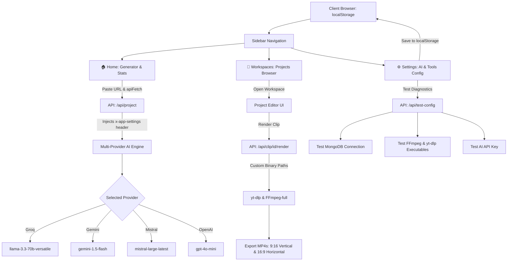

# Dashboard Architecture & LocalStorage Configuration Walkthrough

We have upgraded the application into a SaaS-grade **Dashboard System** featuring a left sidebar navigation, dedicated workspaces browser, multi-provider AI engine (Groq, Gemini, Mistral, OpenAI), custom tool binary paths, and full client-side **`localStorage`** configuration persistence with zero server `.env` dependencies.

---

## 🏗️ What Was Built & Upgraded



---

## 🚀 Key Features Implemented

### 1. Modern Sidebar & Dashboard Layout (`components/Sidebar.jsx` & `components/DashboardLayout.jsx`)
- **Persistent Sidebar Navigation:**
  - 🏠 **Home** (`/`): URL video analyzer, summary statistics (Workspaces, AI Engine, Styles), recent workspace launcher cards.
  - 📁 **Workspaces** (`/workspaces`): Dedicated project browser with instant search, duration badges, direct workspace launchers, and workspace deletion.
  - ⚙️ **Settings** (`/settings`): Comprehensive configuration manager for AI keys, tool paths, and database URI.
- **Real-Time Client Status Widget:**
  - Displays the active AI engine (e.g. ⚡ Groq / ✨ Gemini / 🔮 Mistral / 🧠 OpenAI).
  - Shows database mode (`localStorage` + Dynamic MongoDB URI).
  - Shows warning badge if required API keys are missing.
- **Mobile Responsive Drawer:** Collapsible sidebar with smooth backdrop and hamburger toggle.

---

### 2. Client-Side `localStorage` Settings Architecture (`lib/settings-client.js` & `lib/settings.js`)
- **Zero Server Credentials:** Everything is stored directly in browser `localStorage`.
- **`apiFetch` Wrapper:** Automatically attaches the `x-app-settings` header with URI-encoded JSON of the settings to all API calls.
- **Dynamic Server Resolution:** All backend routes (`/api/project`, `/api/clip/[id]/render`, `/api/project/[id]`) read settings directly from headers/body to configure AI requests, database connections, and FFmpeg/yt-dlp paths on the fly.

---

### 3. Multi-Provider AI Engine with Groq Support (`lib/ai.js`)
- **Groq Integration:** Added high-speed inference via `llama-3.3-70b-versatile` (`https://api.groq.com/openai/v1/chat/completions`).
- **4 Configurable AI Providers:**
  1. **Groq:** `llama-3.3-70b-versatile` (Ultra-fast, sub-second responses)
  2. **Google Gemini:** `gemini-1.5-flash` / `gemini-2.0-flash`
  3. **Mistral AI:** `mistral-large-latest`
  4. **OpenAI:** `gpt-4o-mini` / `gpt-4o`
- **Active Engine Preference:** Automatically prioritizes your chosen provider with automatic fallback to any available key.

---

### 4. Dynamic Binary Execution & MongoDB Connection (`lib/video.js` & `lib/db.js`)
- **Custom Tool Paths:**
  - `ffmpeg_path`: Dynamic path configuration with presets for Apple Silicon Homebrew (`/opt/homebrew/opt/ffmpeg-full/bin/ffmpeg`) and Intel/Linux (`/usr/local/bin/ffmpeg`).
  - `yt_dlp_path`: Dynamic path configuration (`/opt/homebrew/bin/yt-dlp` or `/usr/local/bin/yt-dlp`).
- **Dynamic MongoDB Connection:** `dbConnect(customUri)` connects to the URI provided in `localStorage` (supports local MongoDB or MongoDB Atlas `mongodb+srv://...`).

---

### 5. Diagnostics & System Verification (`app/api/test-config/route.js`)
- **1-Click Test Diagnostics:** Click **"Test Diagnostics"** in Settings to run live health checks on:
  - Active AI API Key validity.
  - MongoDB connection response.
  - FFmpeg binary existence and version check.
  - yt-dlp binary existence and version check.

---

### 6. Cleaned Up Social Publishing
- Removed YouTube and Instagram OAuth connection panels, auth endpoints (`app/api/auth/*`), and direct upload publishing handlers from the workspace UI.

---

## 🛠️ Verification Results

- **Next.js Production Build:** Completed successfully with zero compiler warnings or errors:
  ```bash
  ✓ Compiled successfully in 4.1s
  ✓ Generating static pages (8/8) in 241ms
  ```
- **Binary Detection Test:**
  - FFmpeg: `ffmpeg version 9.0.1` (Detected at `/opt/homebrew/opt/ffmpeg-full/bin/ffmpeg`)
  - yt-dlp: `yt-dlp 2026.08.19` (Detected at `/opt/homebrew/bin/yt-dlp`)

---

## 🖥️ How to Use

1. **Start the Development Server:**
   ```bash
   npm run dev
   ```
2. **Open the App:** Navigate to [http://localhost:3000](http://localhost:3000).
3. **Configure Settings:** Click **Settings** in the sidebar:
   - Choose your preferred AI engine (Groq, Gemini, Mistral, or OpenAI).
   - Enter your API Key.
   - Set your MongoDB URI and Tool paths (or click the Homebrew preset).
   - Click **Save Configuration** (saved to `localStorage`).
   - Click **Test Diagnostics** to verify all components.
4. **Generate Shorts:** Go to **Home**, paste a YouTube URL, and let AI curate your conversational shorts!
