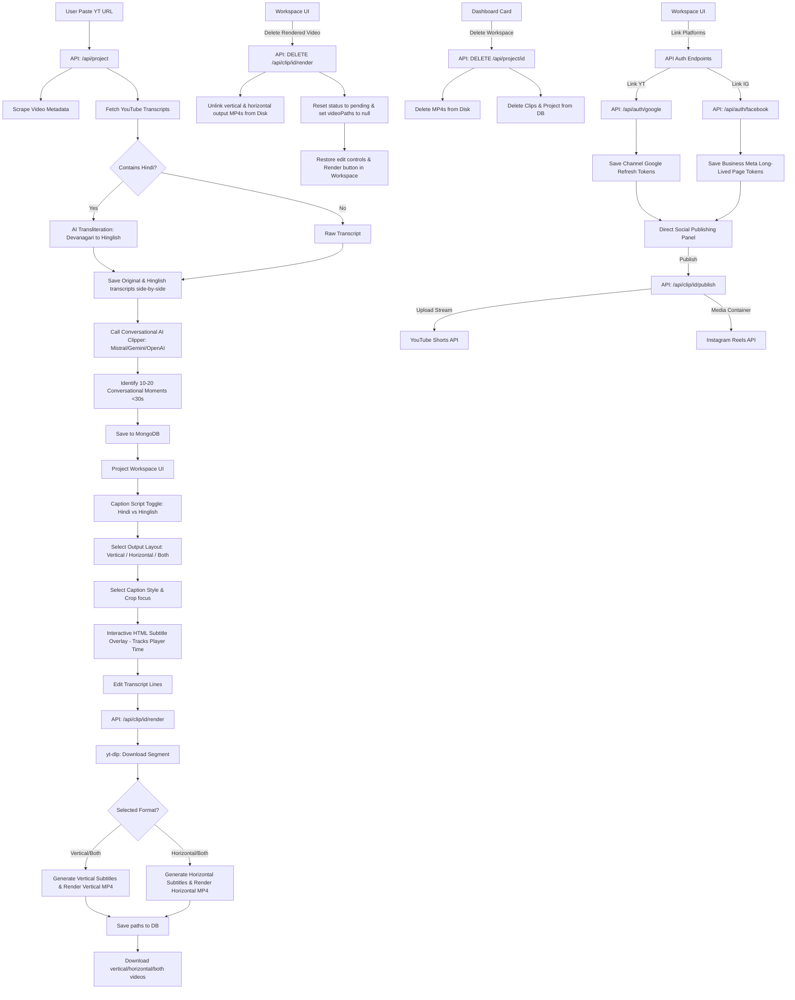

# YouTube Shorts Generator Walkthrough

We have successfully built and verified the YouTube Shorts Generator application! The project compiles with zero warnings or errors. Here is a summary of the stack, implementation, and enhanced features.

---

## 🏗️ Architecture & Features



### 1. Conversational AI Clipper & Transliteration (`lib/ai.js`)
- **Conversational Clipping Optimization:** The AI prompt is highly optimized to ensure clips capture complete, coherent, and highly relevant conversations (Q&As, explanations, jokes, arguments) under 30 seconds, preventing cut-offs.
- **Hinglish Transliteration:** Automatically transliterates Hindi transcripts from Devanagari script to Hinglish (Latin letters) while strictly preserving start and duration timings.
- **Dual Script Storage:** Retains both Devanagari script and Latin Hinglish transcripts side-by-side in MongoDB, letting the user toggle between them.

### 2. Multi-Layout Rendering Pipeline (`lib/video.js` & `lib/youtube.js`)
- **Vertical cropped layout (9:16):** Crops landscape 16:9 videos to 9:16 vertical ratio with adjustable alignments (Left, Center, Right) and burns in vertical styled subtitles.
- **Horizontal widescreen layout (16:9):** Skips cropping, scaling subtitles and adjusting bottom margins to fit widescreen layouts natively, and burns them directly onto the landscape video.
- **Fast Clip Downloads:** Uses `yt-dlp` section downloads (`--download-sections`) combined with `ffmpeg-full` to fetch only the required frames in seconds.

### 3. API Handlers (`app/api/`)
- `POST /api/project`: Onboarding route. Detects Hindi, generates dual transcripts, clips, and returns JSON.
- `GET /api/project/[id]`: Returns data.
- `DELETE /api/project/[id]`: **Workspace Deletion.** Deletes clips, project records, and local rendered `.mp4` video files to reclaim disk space.
- `POST /api/clip/[id]/render`: Triggers download, layout selection, runs FFmpeg render, and saves outputs.
- `DELETE /api/clip/[id]/render`: **Delete Rendered Video (Reset).** Unlinks all rendered `.mp4` files (`outputs/[id]-vertical.mp4`, etc.) from disk and resets the status back to `'pending'` (Ready to Render) with all paths cleared.
- `GET /api/clip/[id]/download`: Streams the rendered MP4 file based on the query parameter (e.g. `?format=vertical` or `?format=horizontal`).
- `GET /api/auth/status`: Checks if YouTube and Instagram accounts are connected, returning names and token validity.
- `POST /api/clip/[id]/publish`: Direct video publishing endpoint that uploads rendered `.mp4` video streams to YouTube Shorts (`googleapis`) and creates reels containers on Meta Graph API to upload Reels to connected Instagram Business Accounts.

### 4. Interactive Cosmic UI (`app/page.js` & `app/project/[id]/page.js`)
- **Dashboard Deletion:** Trash-can delete triggers with confirmation.
- **Interactive Live Subtitle Preview:** Loads the YouTube Iframe API, polls playback time at 150ms intervals, and renders live HTML styled subtitle overlays. Capitalizes and highlights spoken words in yellow in real-time for the **Hormozi style**.
- **Visual Style Cards:** Custom styled CSS previews for Hormozi, Minimalist, and Classic subtitles.
- **Caption Script Selector:** Toggles between Original (Hindi) and Hinglish script options, instantly updating the subtitle editor and the live HTML overlay.
- **Layout Format Selector:** Choose "Vertical (9:16)", "Horizontal (16:9)", or "Both layouts" before triggering the render. Once completed, separate download buttons will appear dynamically based on the rendered layouts.
- **Reset Render & Edit Button:** If a clip is completed, a red **Delete Rendered Video (Reset Clip)** button appears. Clicking it clears the files, unlocks the subtitle editor, and restores the "Render Video Clip" button.
- **Direct Social Publishing Panel:** If a clip is completed:
  - Connect accounts easily with redirection triggers to Google & Meta OAuth pages.
  - Show status indicators of connected profiles.
  - Prefill custom title, descriptions, hashtags, and select YouTube privacy.
  - Tap "Publish" to upload video files directly from your workspace!

---

## 🛠️ Verification Results

1. **System Tools:** Installed `ffmpeg-full` and `yt-dlp` via Homebrew.
2. **Local Database:** Verified MongoDB running on port `27017` and successfully tested connections.
3. **Next.js Production Build:** Completed successfully with zero compiler warnings/errors:
   ```bash
   ✓ Compiled successfully in 12.1s
   ```

---

## 🚀 How to Run the App

1. **Configure OAuth Credentials in [`.env.local`](file:///Users/nitinbhagat/Everything/shorts/.env.local):**
   Open the env file and input your Client Keys:
   ```env
   # AI Settings
   GEMINI_API_KEY=your-gemini-key

   # YouTube (Google OAuth) credentials
   GOOGLE_CLIENT_ID=your-google-oauth-client-id
   GOOGLE_CLIENT_SECRET=your-google-oauth-client-secret

   # Instagram (Facebook/Meta OAuth) credentials
   FACEBOOK_APP_ID=your-facebook-app-id
   FACEBOOK_APP_SECRET=your-facebook-app-secret
   
   # Optional: Public url if exposing server via ngrok (e.g. for Meta container downloads)
   # PUBLIC_APP_URL=https://xxxx.ngrok-free.app
   ```

2. **Start the Development Server:**
   Run the following command in your terminal:
   ```bash
   npm run dev
   ```

3. **Open the Application:**
   Navigate to [http://localhost:3000](http://localhost:3000) in your web browser. Paste a YouTube URL and enjoy creating clips!
